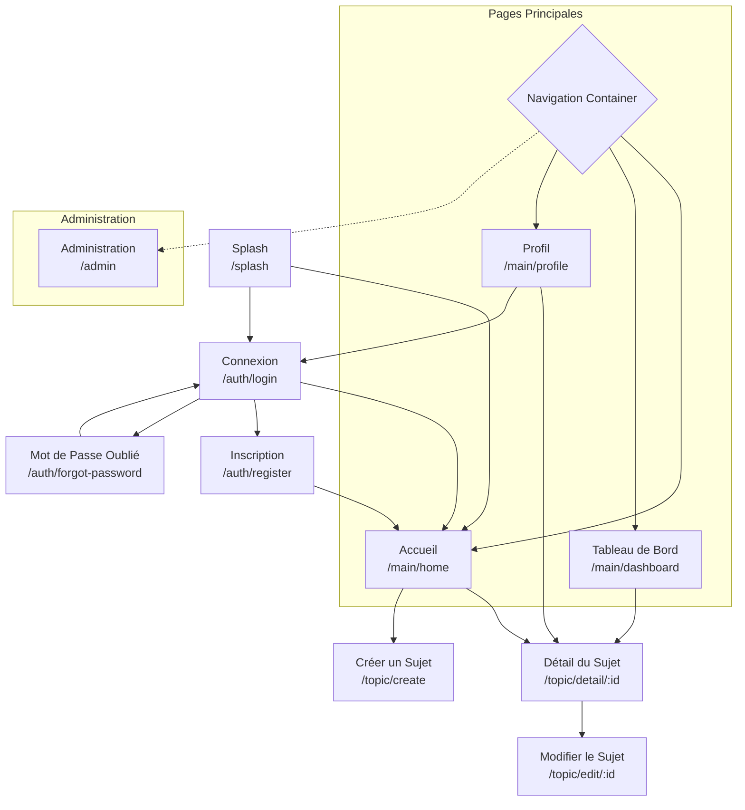

# User Flow — CampusForum

```mermaid
graph TD
  %% Navigation Container (Max 4 pages)
  NavContainer{Navigation Container}

  %% Core Pages (accessible from main navigation)
  subgraph "Pages Principales"
    NavContainer --> Home["Accueil<br/>/main/home"]
    NavContainer --> Dashboard["Tableau de Bord<br/>/main/dashboard"]
    NavContainer --> Profile["Profil<br/>/main/profile"]
  end

  %% Authentication Flow (Entry Points)
  Splash["Splash<br/>/splash"] --> Login["Connexion<br/>/auth/login"]
  Splash --> Home
  Login --> Register["Inscription<br/>/auth/register"]
  Login --> ForgotPassword["Mot de Passe Oublié<br/>/auth/forgot-password"]
  Login --> Home
  Register --> Home
  ForgotPassword --> Login

  %% Home Feature - Topic Management
  Home --> TopicDetail["Détail du Sujet<br/>/topic/detail/:id"]
  Home --> CreateTopic["Créer un Sujet<br/>/topic/create"]

  TopicDetail --> EditTopic["Modifier le Sujet<br/>/topic/edit/:id"]

  %% Dashboard Feature
  Dashboard --> TopicDetail

  %% Profile Feature
  Profile --> TopicDetail
  Profile --> Login

  %% Admin Feature (Optional)
  subgraph "Administration"
    NavContainer -.-> Admin["Administration<br/>/admin"]
  end
```
